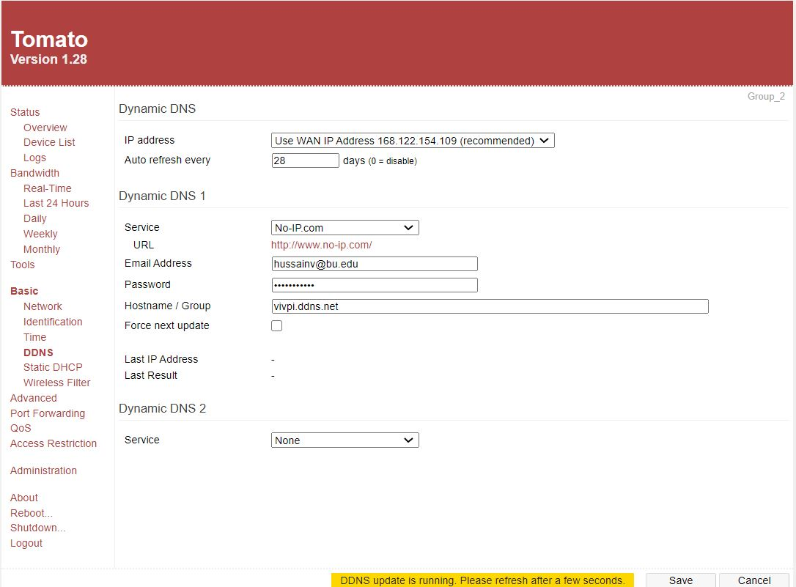
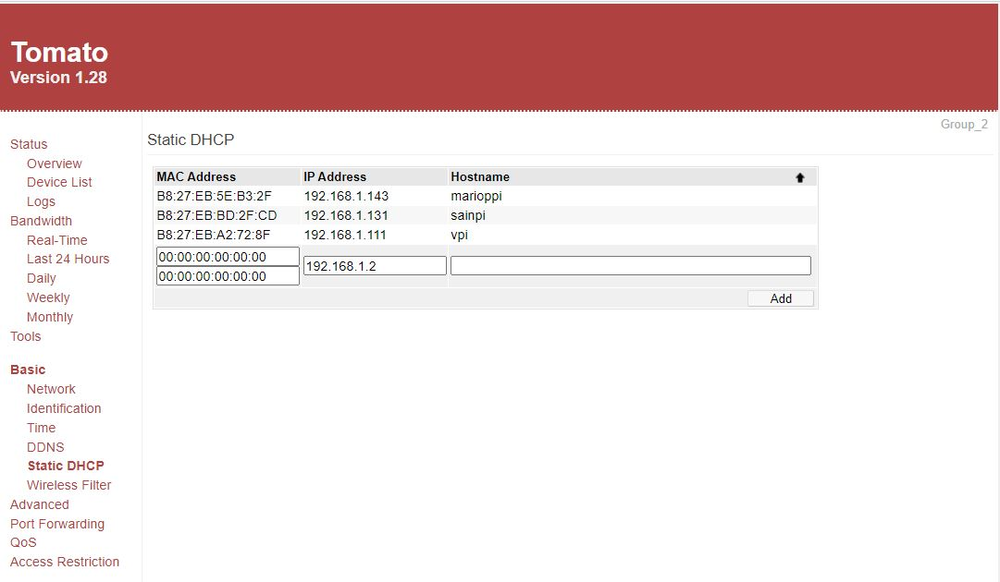
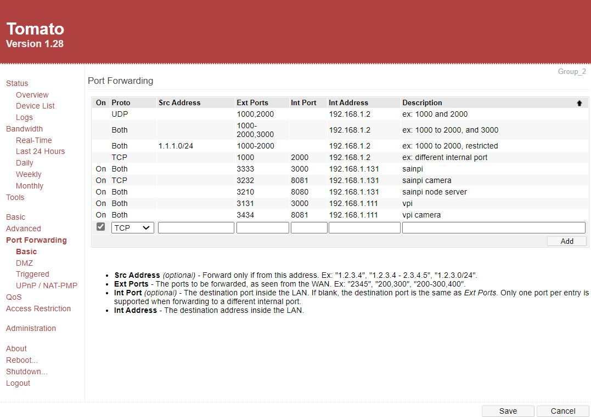
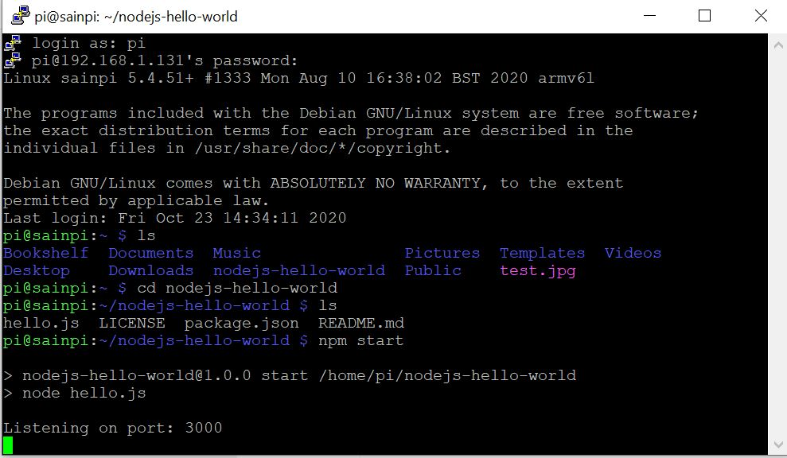
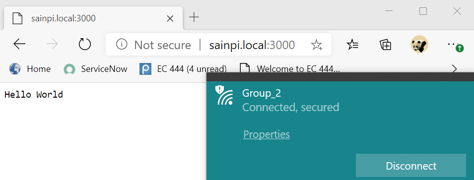
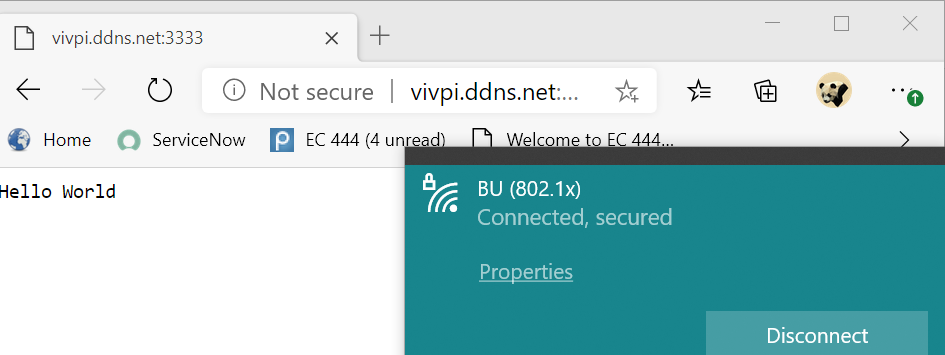

# DYNDNS for Pi

Authors: Hussain Valiuddin, Mario Han, Vivek Cherian
Date: 2020-10-23

---

## Summary

In this skill, we set up a dynamic dns for our router. We used noip.com to host the ddns vivpi.ddns.net. We then gave each of our Pi's a static IP and then set up port forwarding to enable connecting to the Nodejs server from over the internet.

The Hello World Nodejs server is run on the Pi and it displays on sainpi:3000 when connected to the router. We port forwarded the raspberrypi port 3000 to port 3333 to view the server from any internet connection and it works as the website can be reached while on BU internet and while on mobile data.

## Sketches and Photos

## Modules, Tools, Source Used Including Attribution

## Supporting Artifacts

---
